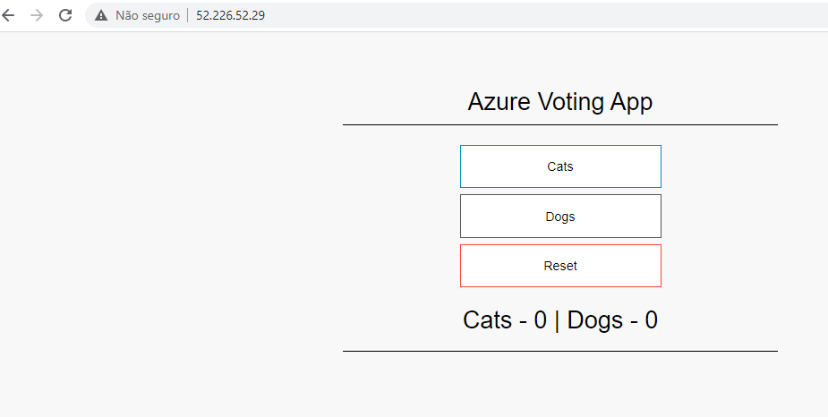

# Deploy a simple application on AKS from Bamboo custom agent
- import images from docker hub registry to Azure ACR
- deploy deployment.yaml on AKS
- Azure votes app link: https://docs.microsoft.com/en-us/azure/aks/tutorial-kubernetes-prepare-app

# Deploy application

## git clone
```
git clone https://github.com/edtroleis/atlassian-bamboo/

cd atlassian-bamboo/deploy
chmod +x deploy.sh
```

## Set service principal variables
```
export PUBLISH_SP="<CLIENT_ID>"
export PUBLISH_SP_SECRET_ID="<CLIENT_SECRET>"
export TENANT_ID="<TENANT_ID>"

On page https://github.com/edtroleis/atlassian-bamboo/tree/master/azure-configuration explain how to create a service principal
```

## Set AKS and ACR variables
```
aks_name="<AKS_NAME>"
aks_resource_group="<AKS_RESOURCE_GROUP>"
export acr_name="<ACR_NAME>.azurecr.io"
```

## run deploy.sh file
```
./deploy.sh

After execution get the ip address informed and test the application


```